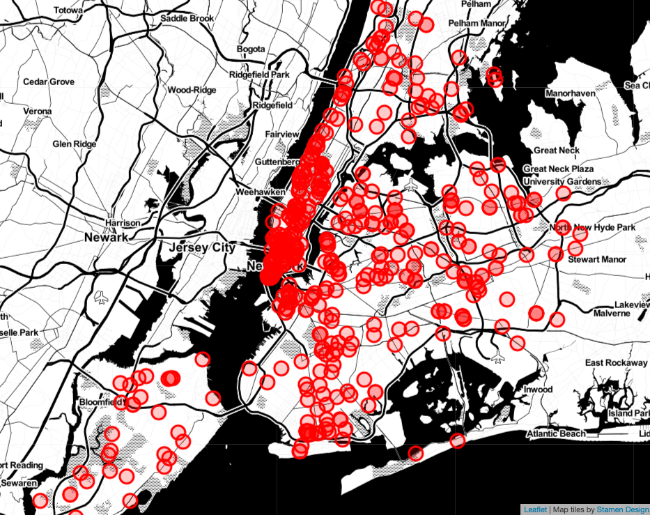

# Visualizing Critical Violations of NYC Restaurant Inspections 2019

# Aim

The aim of this mini project was to learn about geocoding and Folium, which is a Python package built on a Javascript library called Leaflet.js for map visualizations. 

# Data

NYC Restaurant Inspections Data (last updated May 6th, 2019) was used for this project. It was cleaned and reorganized into two subsets of data, one of inspections with a count of critical violations and the other of inspections with a count of non-critical violations. For this project, I only used a subset of the data to practice. 

# Geocoding

GeoPy, a Python 2 and Python 3 client for using several popular geocoding web services according to their documentation, was used for this project. To keep it simple, the default geocoder, Nominatim, was selected, which uses OpenStreetMap data to convert addresses to geographic data. 800 data points were run through the geocoder via GeoPy in groups of 100. Only 486 addresses were able to be converted to geographic coordinates. Those unable to be converted were dropped from the final dataset used for visualization.

# Visualization

Folium was the visualization library used to map the coordinates. 

Here is a graph of the individual restaurants plotted on the map:

    

Here is an image of the restuarants clustered plotted on the map. As the map is zoomed in or out, the clusters will separate out into individual points or group up to larger clusters respectively.

    

